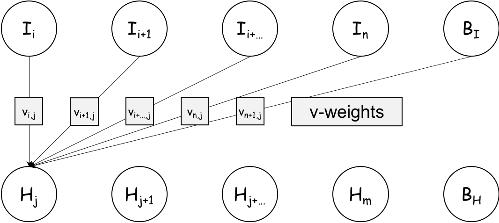
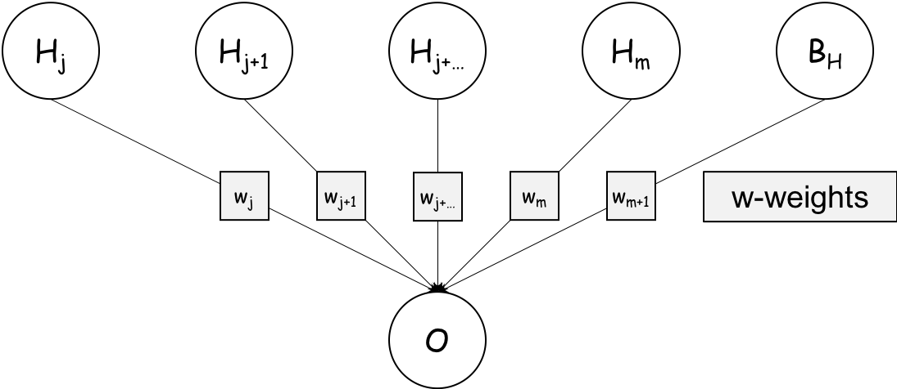
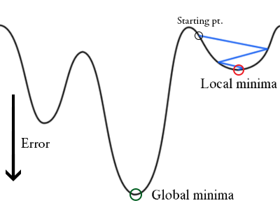

```{r setup, include=FALSE}
knitr::opts_chunk$set(echo = FALSE)
library('tidyverse')
```

## Who am I?

- Leon Eyrich Jessen

- Apr. 2010: MSc in biotech engineering (wetlab molecular biology) from DTU

- Apr. 2014: PhD in bioinformatics from DTU
    - Immunoinformatics of Placental Malaria Vaccine Development

- Apr. 2014 - Jan. 2015: Postdoc at Steno Diabetes Centre
    - Identification of protective genetic factors in relation to diabetes complications

- Jan. 2015 - Sep. 2017: Postdoc / Senior Researcher at Gentofte Hospital (COPSAC)
    - Genetics of Childhood Asthma

- Sep. 2017 - present: Postdoc in the Immunoinformatics and Machine Learning Group at DTU Bioinformatics
    
## What is Bioinformatics?

- Intrinsically interdisciplinary, the intersection of biology, math and computer science:

```{r, out.width = "600px", fig.align="center"}
knitr::include_graphics("figures/venn_bioinformatics.png")
```

## What do I do with bioinformatics?

- Deep Learning models of molecular interactions in the human immune system:

```{r, out.width = "600px", fig.align="center"}
knitr::include_graphics("figures/venn_immunoinformatics.png")
```

## How do we work?

- The group is headed by Professor Morten Nielsen

- We focus on modelling molecules of the immune system

- We rely on public and collaborative data, no data, no models

- We have an applied focus (cancer immunotherapy and infectious diseases)

- Models are developed iteratively in context with "live" data

- We focus on model performance _not_ on explanatory variables

- Alongside the scientific publication, we create webservers for easy access to methods, which are often used by non-computational researchers

- We teach:
    - Protein Structure and Computational Biology
    - Algorithms in Bioinformatics
    - Immunological Bioinformatics (My course)
    - Hackinars in Bioinformatics

# Crash Course in Neural Networks

## What are Artificial Neural Networks?

```{r, out.width = "600px", fig.align="center"}
knitr::include_graphics("figures/Blausen_0657_MultipolarNeuron.png")
```

_Source: [Bruce Blaus](https://commons.wikimedia.org/wiki/User:BruceBlaus) | [Multipolar Neuron](https://upload.wikimedia.org/wikipedia/commons/1/10/Blausen_0657_MultipolarNeuron.png) | [CC BY 3.0](https://creativecommons.org/licenses/by/3.0/)_

## What are Artificial Neural Networks?

- A mathematical framework for mimicking how the human brain processes data
- The human brain consists of 100.000.000.000 cells
- Together they form an intrigate network
- Through hundreds of thousands of years evolution has fine tuned our brain for one purpose: Processing massive amounts of data!
- Think about it, our brain is a data center!
- Our brains processes vision, smell, taste, sound and physical touches in order for you to exist and interact with the world - All of which is happening inside you right now!

## Why are Artificial Neural Networks so powerful?

- ANNs capture context dependence!
- I.e. the “meaning” of each variable depends not only on its observed value, but also on the context in which it was observed

```{r, out.width = "600px", fig.align="center"}
knitr::include_graphics("figures/HUMAN.png")
```

# Making a Prediction: The Feed Forward Algorithm

## Example: Fully Connected Neural Network

```{r, out.width = "600px", fig.align="center"}
knitr::include_graphics("figures/ann_01.png")
```

## Example: Fully Connected Neural Network

- Flow from input layer (features) to hidden layer:

    $H_{j} = I_{i} \cdot v_{i,j} + I_{i+1} \cdot v_{i+1,j} + I_{i+...} \cdot v_{i+...,j} + I_{n} \cdot v_{n,j} + B_{I} \cdot v_{n+1,j} =$
    $\sum_{i}^{n} I_{i} \cdot v_{i,j} + B_{I} \cdot v_{n+1,j} = \sum_{i}^{n+1} I_{i} \cdot v_{i,j} = \textbf{I} \cdot \textbf{v}_j$  

- Non-linear transformation of hidden layer input to hidden layer output (activation function):

    $S(H_{j}) = \frac{1}{1+e^{-H_{j}}}$

```{r, out.width = "600px", fig.align="center"}

```

## Example: Fully Connected Neural Network

- Flow from hidden layer to output layer:

    $O = H_{j} \cdot w_{j} + H_{j+1} \cdot w_{j+1} + H_{j+...} \cdot w_{j+...} + H_{m} \cdot w_{m} + B_{H} \cdot w_{m+1} =$
    $\sum_{j}^{m} H_{j} \cdot w_{j} + B_{H} \cdot w_{m+1} = \sum_{j}^{m+1} H_{j} \cdot w_{j} = \textbf{H} \cdot \textbf{w}$  
    
- Non-linear transformation of output layer input to output layer output (activation function):

    $S(O) = \frac{1}{1+e^{-O}}$

```{r, out.width = "600px", fig.align="center"}

```

# Training a Network: The Back Propagation Algorithm

## Example: Fully Connected Neural Network

```{r, out.width = "500px", fig.align="center"}

```

Activation function: $S(x) = \frac{1}{1+e^{-x}}$, Loss (error) function: $E = MSE(O,T) = \frac{1}{2} \left( o - t \right)^2$, Optimisation (weight updates) using stochastic gradient descent: $\Delta w = - \epsilon \frac{\delta E}{\delta w}$ and $\Delta v = - \epsilon \frac{\delta E}{\delta v}$ ($\epsilon$ = learning rate)

# Function examples

## Activation Function - Sigmoid

```{r, echo=FALSE, out.width = "600px", fig.align='center'}
tibble(x = seq(-10, 10, length.out = 100), y = 1 / (1 + exp(-x))) %>%
  ggplot(aes(x,y)) +
  geom_line() +
  xlab("Input") +
  ylab("Output = S(input)") +
  ggtitle("Sigmoid Activation") +
  theme_bw() +
  theme(text = element_text(size = 20))
```

- Low input and the neuron is turned off (emits 0)
- Medium input and the neuron emits a number inbetween 0 and 1
- High input and the neuron is turned on (emits 1)

## Activation Function - Rectified Linear Unit

```{r, echo=FALSE, out.width = "600px", fig.align='center'}
ReLU = function(x){ return( ifelse(x < 0, 0, x) ) }
tibble(x = seq(-10, 10, length.out = 100), y = ReLU(x)) %>%
  ggplot(aes(x,y)) +
  geom_line() +
  xlab("Input") +
  ylab("Output = S(input)") +
  ggtitle("ReLU Activation") +
  theme_bw() +
  theme(text = element_text(size = 20))
```

- Input less than zero and the neuron is turned off (emits 0)
- Input larger than zero and the neuron simply propagates the signal (emits x)

## Optimiser: Stochastic Gradient Descend

- The optimisation cannot be solved analytically, so numeric approximations are used

```{r, out.width = "500px", fig.align="center"}

```

## Loss/error function

- Mean squared error quantifies the distance from the true value to the prediction

```{r, echo=FALSE, out.width = "800px", fig.align='center'}
set.seed(319133)
n = 1000
preds_bin = tibble(y_true = sample(c(0,1), n, replace = TRUE),
       y_pred = runif(n),
       mse = 1/2 * (y_true - y_pred) ** 2,
       pred_type = 'binary target')

preds_con = tibble(y_true = runif(n),
                   y_pred = runif(n),
                   mse = 1/2 * (y_true - y_pred) ** 2,
                   pred_type = 'continuous target')

preds = bind_rows(preds_bin, preds_con)

preds %>%
  ggplot(aes(x = y_pred, y_true, colour = mse, size = mse)) + 
  geom_point() +
  geom_abline(intercept = 0, slope = 1, linetype = 'dashed') +
  theme_bw() +
  facet_wrap(~pred_type, nrow = 1) +
  theme(legend.position = "bottom", text = element_text(size = 12))
```

# Summary

## Key Terms and Concepts

- Features: The matrix of variables used for training th ANN
- Input layer: The first layer of neurons being fed the examples from the feature matrix
- Hidden layer(s): The layers connecting the visible input and output layers
- Output layer: The layer creating the final output (prediction)
- Feed forward algorithm: The algorithm used to make a prediction, where information flows from the input via the hidden to the output layer
- Activation function: The function used to make a non-linear transformation of the set of linear combinations feeding into a neuron
- Back propagation algorithm: The algorithm used for iteratively training the ANN
- Loss/error function: The function used to measure the error between the true and the predicted value, when training the ANN
- Optimiser: The function used for optimising the weights, when training the ANN
- An ANN can do both binary and multiclass classification and also regression
