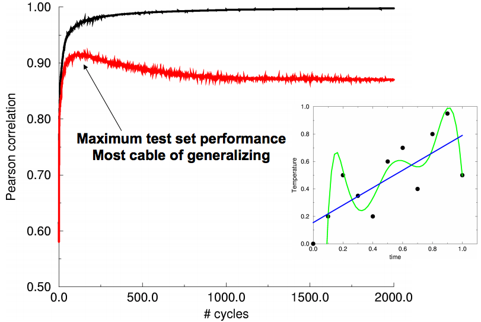
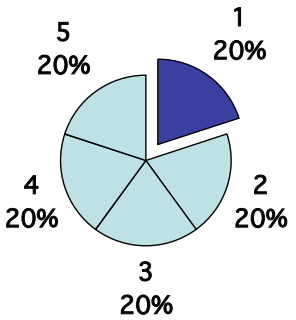
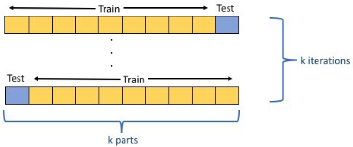
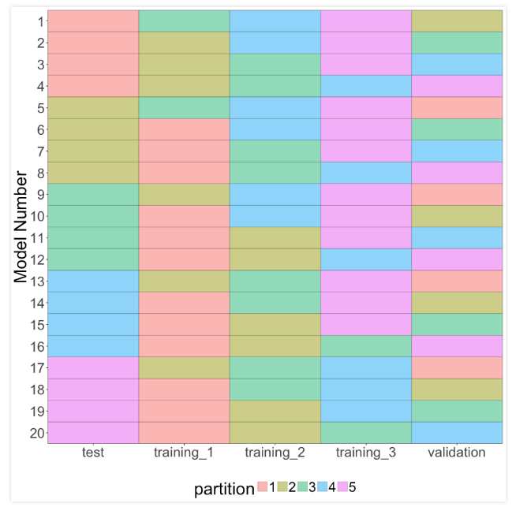
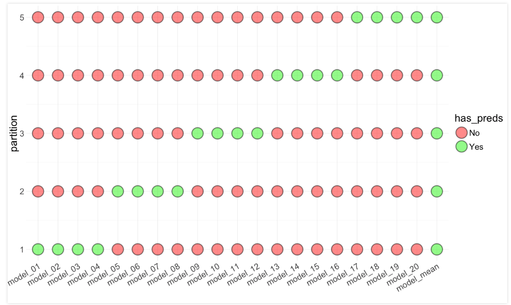

```{r setup, include=FALSE}
knitr::opts_chunk$set(echo = FALSE)
library('tidyverse')
```

## Traditional linear modelling

- Given ALL the data, we fit a model using our experience to perform appropriate variable transformations

- We then look at confidence intervals and p-values for the estimates

- Finally, we report significant explanatory variables to response variables associations

- I.e. explanatory modelling

- In predictive modelling, we are interested in ensuring, that the model has as much predictive power as possible on UNSEEN data

- We do this by splitting the data into a `test` and a `train` set, often `20%/80%` split

## So many parameters...

- ANNs (can) have A LOT of parameters, in the millions... This means that overfitting is definetely something to be considered

```{r, out.width = "600px", fig.align="center"}

```

- At each epoch we fit weights, so we need to stop fitting at the epoch, where the model has its maximum extrapolatable capacity, but how?

## Cross Validation

- The `20%/80%` split can be illustrated as follows

```{r, out.width = "300px", fig.align="center"}

```

- So we split the data randomly into 5 parts, train on 4 and test on 1

- But this only allows us to see the performance on one portions of the data

## K-fold cross validation

1. Split the data into `k` parts

2. Use `1` part for testing and `k-1` parts for training

3. Iterate through the folds until all parts have been used for training and testing

4. At each round, record the performance

5. Calculate the average performance, which can be used for heuristic hyperparameter optimisation

```{r, out.width = "600px", fig.align="center"}

```

## Wisdom of the Crowd

One day in the fall of 1906, the British scientist Fracis Galton left his home and headed for a country fair… He believed that only a very few people had the characteristics necessary to keep societies healthy. He had devoted much of his career to measuring those characteristics, in fact, in order to prove that the vast majority of people did not have them. … Galton came across a weight-judging competition…Eight hundred people tried their luck. They were a diverse lot, butchers, farmers, clerks and many other no-experts…The crowd had guessed … 1.197 pounds, the ox weighted 1.198 [James Surowiecki: "The Wisdom of Crowds. Why the Many are Smarter than the Few"]

## Combining "Wisdom of the Crowd" with K-fold CV

- No single network will _always_ perform best

- Split data into 5 parts, train 5 models

- Keep each of the five models

- Use the ensemble of 5 models to make new predictions by avering over the 5 predictions

```{r, out.width = "300px", fig.align="center"}

```

## Early stopping using nested K-fold CV

- In nested K-fold CV, with `k=5`, we use 3 sets for training, 1 set for validation (ES) and 1 set for testing

```{r, out.width = "600px", fig.align="center"}

```

## Early stopping using nested K-fold CV

- In nested K-fold CV, with `k=5`, we use 3 sets for training, 1 set for validation (ES) and 1 set for testing

```{r, out.width = "500px", fig.align="center"}

```

## Early stopping using nested K-fold CV

- This creates and ensemble of `k(k-1) = 20` models

```{r, out.width = "700px", fig.align="center"}

```

## The Ensemble Approach

- We use it a lot in our work

- It has proven to perform very well again and again

- Even removing models, which seem to perform poorly has a negative impact on the overall performance

## Summary

- Overfitting is a definite issue in deep learning

- Use cross validation

- Use domain specific knowledge

- Ensemble models are very powerful

# Time for exercises!
